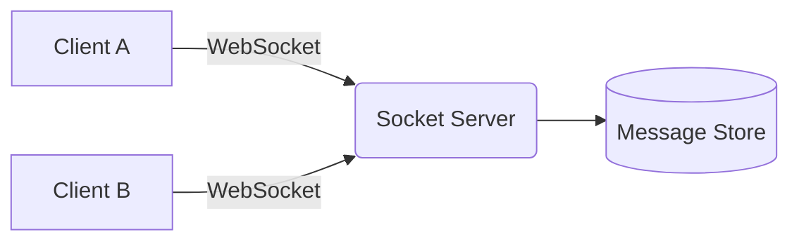
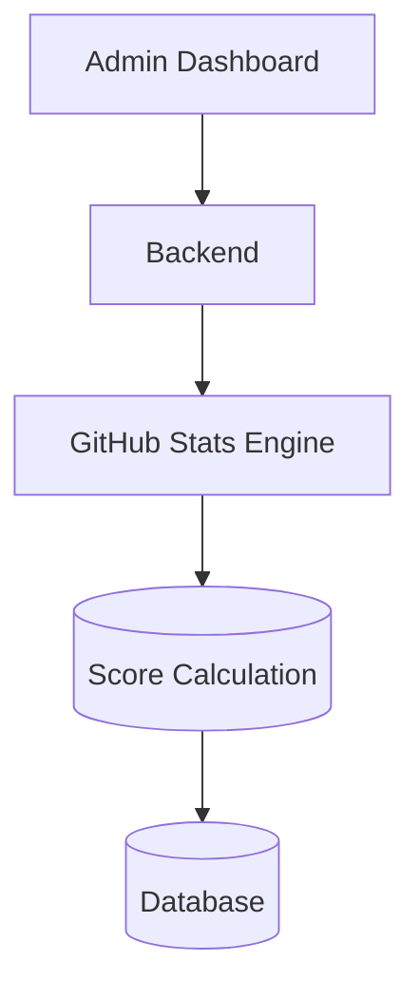
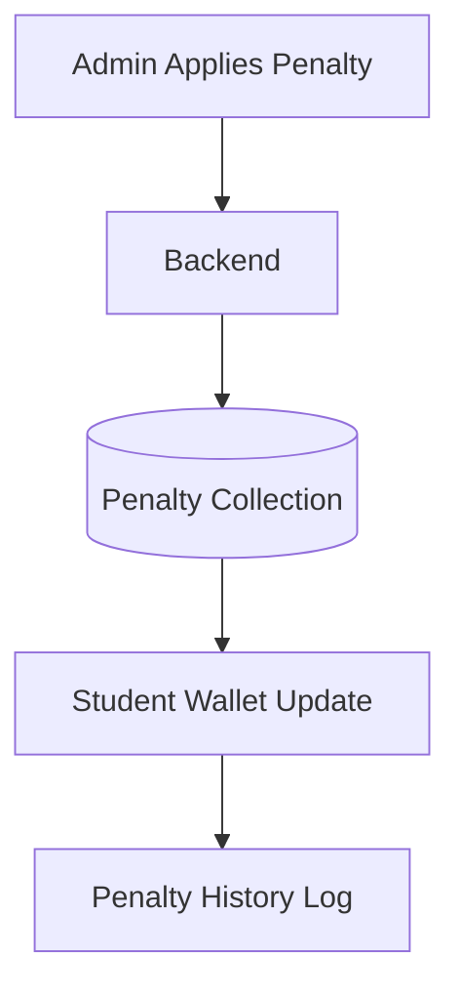
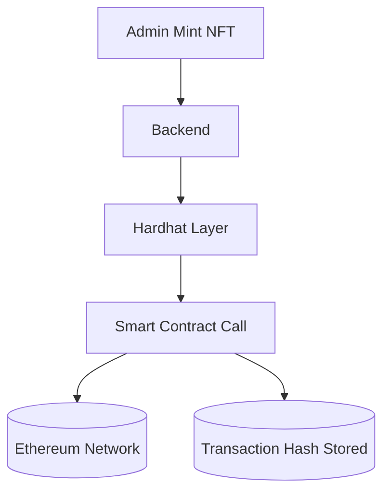
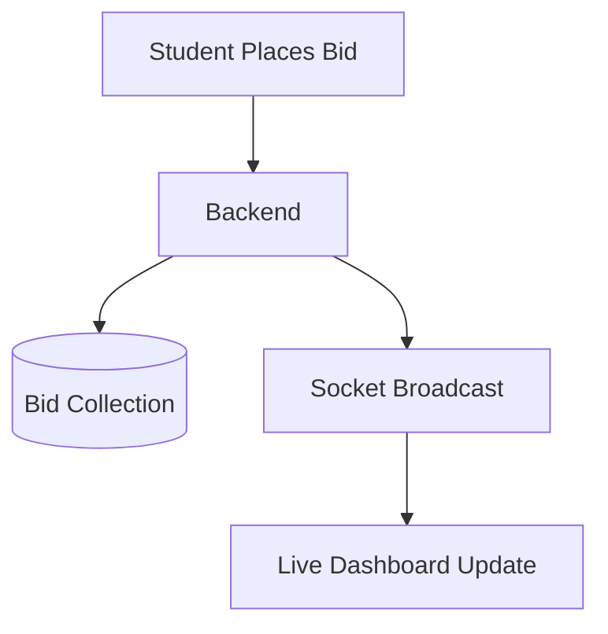
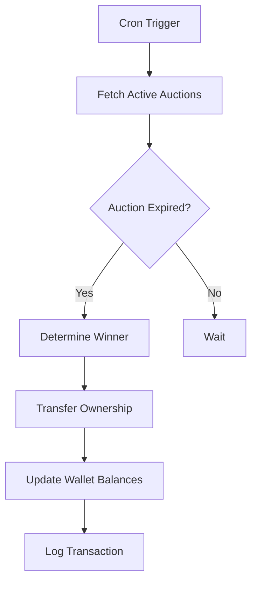
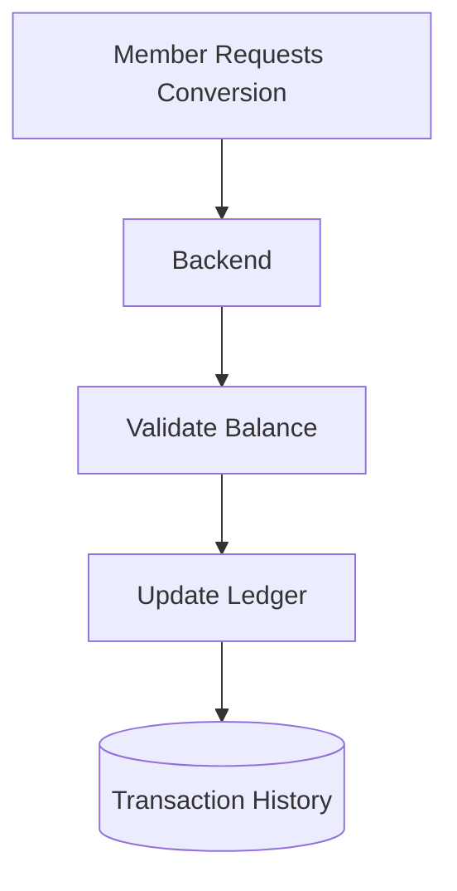
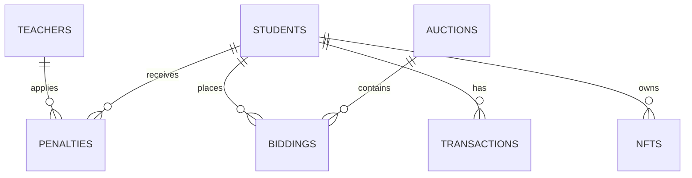
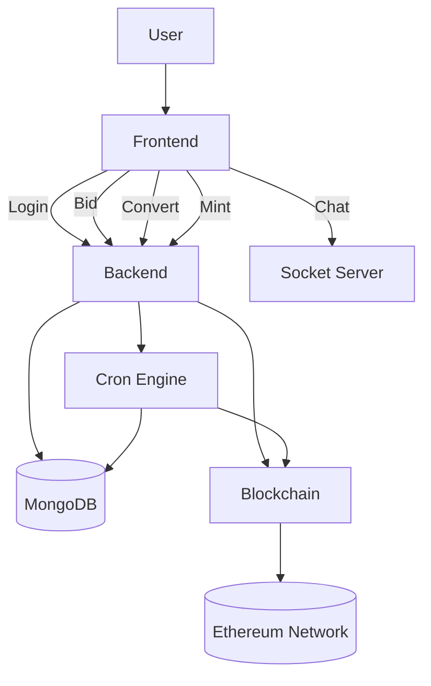

# YAR-Coin-2.0 Official Architecture

> A decentralized bussiness model for contribution & incentive ecosystem powered by real-time auctions, NFT minting, DEX conversion, and contribution-based penalties.

---
<pre> 
  # Clone repo
  $ git clone https://github.com/aijadugar/YAR-Coin-2.0.git 
  $ cd YAR-Coin-2.0 
  $ cd server/yarlabs-hh && npm install && npx hardhat node 
  
  # Open new terminal
  $ cd server/yarlabs-py && python deploy_yarcoin.py 
  
  # Open another terminal
  $ cd server/yarlabs-be && npm start

  # Open next termial
  $ cd client && npm run dev
</pre>
---

# Overview

**YAR-Coin-2.0** is a full-stack blockchain-integrated ecosystem designed to:

- Reward academic contributions
- Enforce contribution-based penalties
- Mint NFTs for achievements
- Enable token conversion via DEX
- Run live real-time bidding auctions
- Provide socket-based chat communication
- Automate auction settlements using cron jobs

---

# High-Level Architecture

```mermaid
flowchart TD

    A[Frontend - React / Client App] -->|REST APIs| B[Backend - Node.js + Express]
    A -->|WebSocket| C[Socket Server]
    
    B --> D[(MongoDB Database)]
    B --> E[Hardhat Blockchain Layer]
    B --> F[Python Smart Contract Deployment Layer]
    
    B --> G[Cron Job - Auction Settlement Engine]
    
    E --> H[(Ethereum Smart Contracts)]
    
    C --> D
    
    style A fill:#1f2937,color:#fff
    style B fill:#111827,color:#fff
    style C fill:#0f172a,color:#fff
    style D fill:#1e3a8a,color:#fff
    style E fill:#7c3aed,color:#fff
    style H fill:#9333ea,color:#fff
````

---

# Core System Modules

---

## 1 Authentication & Role System

### Roles:

* Admin (Teacher / Mentor / Evaluator / Governor)
* Member (Student / Contributor / Builder / Participant)

### Flow

```mermaid
sequenceDiagram
    participant User
    participant Frontend
    participant Backend
    participant Database

    User->>Frontend: Login Request
    Frontend->>Backend: Send Credentials
    Backend->>Database: Validate User
    Database-->>Backend: User Data
    Backend-->>Frontend: Auth Token + Role
```

---

## 2 Real-Time Chat Tunnel (WebSocket)

* Room-based messaging
* Admin ↔ Member communication
* Used during auctions & dispute discussions



---

## 3 Contribution Tracking & Repository Stats

Admins can evaluate:

* GitHub contribution stats
* Repository analysis
* Contribution scoring logic



---

## 4 Penalty System

Used when:

* Member misses contribution targets
* Rule violations occur

### Architecture



---

## 5 NFT Minting System

Achievements & milestones are minted as NFTs.

### Blockchain Stack:

* Hardhat
* Smart Contracts
* Python deployment scripts



---

## 6 Live Auction & Bidding Engine

### Real-Time Auction Model



---

## 7 Automated Auction Settlement (Cron Engine)

Runs every minute.

### Logic:

* Identify ended auctions
* Determine highest bidder
* Transfer ownership
* Update balances
* Log transactions



---

## 8 DEX Conversion Engine

Convert:

* YAR ↔ USD (Internal ledger based)



---

# Database Design Overview (MongoDB)

### Collections:

* Teachers
* Students
* Transactions
* Penalties
* NFTs
* Biddings
* DEX Ledger
* Messages
* Auctions



---

# Security Architecture

* JWT-based Authentication
* Role-based Authorization
* Wallet Address Validation
* Indexed Queries for Performance
* Controlled NFT Minting (Admin Only)
* Server-Side Auction Settlement (Anti-cheat)

---

# Technology Stack

| Layer           | Technology        |
| --------------- | ----------------- |
| Frontend        | React / Tailwind  |
| Backend         | Node.js / Express |
| Database        | MongoDB           |
| Blockchain      | Hardhat           |
| Smart Contracts | Solidity          |
| Deployment      | Python Scripts    |
| Real-time       | Socket.io         |
| Scheduler       | node-cron         |
| Hosting         | Vercel            |

---

# Complete System Flow



---

# System Philosophy

YAR-Coin-2.0 is built around:

* Contribution → Reward Loop
* Accountability → Penalty Governance
* Achievement → NFT Ownership
* Competition → Live Auctions
* Transparency → Real-time Communication
* Hybrid Web2 + Web3 Architecture

---

# Final Summary

YAR-Coin-2.0 is not just a token system.

It is a **Contribution Economy Framework** that integrates:

* Real-time systems
* Automated governance
* Blockchain ownership
* Gamified learning incentives
* Decentralized value exchange

---

# New version of YARCoin...YAR-Coin-2.0

> Build. Contribute. Compete. Earn. Own.