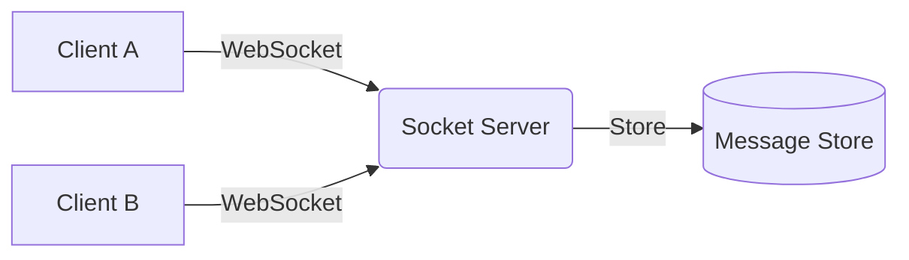
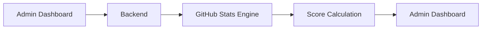
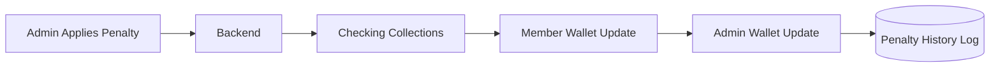
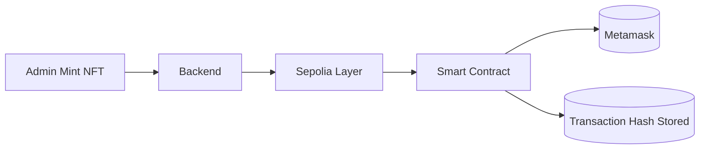
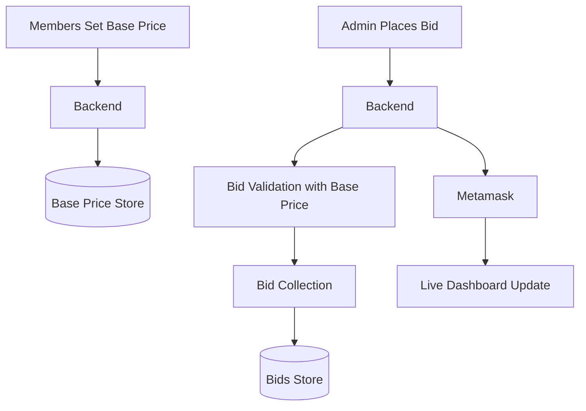
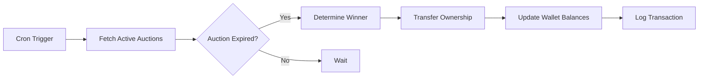
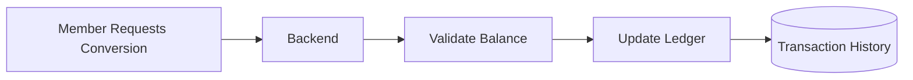
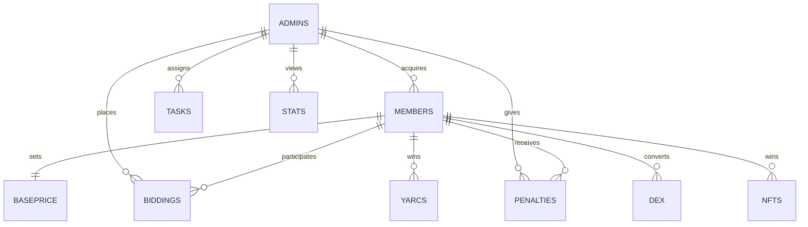

# YAR-Coin-2.0 Official Architecture

> A decentralized bussiness model for contribution & incentive ecosystem powered by real-time auctions, NFT minting, DEX conversion, and contribution-based penalties.

---
<pre> 
  # Clone repo
  $ git clone https://github.com/aijadugar/YAR-Coin-2.0.git 
  $ cd YAR-Coin-2.0 
  $ cd server/yarlabs-hh && npm install && npx hardhat node 
  
  # Open new terminal
  $ cd server/yarlabs-py && python deploy_yarcoin.py 
  
  # Open another terminal
  $ cd server/yarlabs-be && npm start

  # Open next termial
  $ cd client && npm run dev
</pre>
---

# Overview

**YAR-Coin-2.0** is a full-stack blockchain-integrated ecosystem designed to:

- Reward academic contributions
- Enforce contribution-based penalties
- Mint NFTs for achievements
- Enable token conversion via DEX
- Run live real-time bidding auctions
- Provide socket-based chat communication
- Automate auction settlements using cron jobs

---

# High-Level Architecture

```mermaid
flowchart TD

    A[Frontend - React] -->|REST APIs| B[Backend - Express]
    A -->|WebSocket| C[Socket Server]
    
    B --> D[(MongoDB Database)]
    B --> E[Sepolia Blockchain Layer]
    B --> F[Smart Contract Deployment]
    
    B --> G[Auction Settlement Engine]
    
    E --> H[(Smart Contracts)]
    
    C --> D
    
    style A fill:#1f2937,color:#fff
    style B fill:#111827,color:#fff
    style C fill:#0f172a,color:#fff
    style D fill:#1e3a8a,color:#fff
    style E fill:#7c3aed,color:#fff
    style H fill:#9333ea,color:#fff
````

---

# Core System Modules

---

## 1 Authentication & Role System

### Roles:

* Admin (Teacher / Mentor / Evaluator / Governor)
* Member (Student / Contributor / Builder / Participant)

### Flow

```mermaid
sequenceDiagram
    participant User
    participant Frontend
    participant Backend
    participant Database

    User->>Frontend: Login Request
    Frontend->>Backend: Send Credentials
    Backend->>Database: Validate User
    Database-->>Backend: User Data
    Backend-->>Frontend: Auth Token and Role
```

---

## 2 Real-Time Chat Tunnel (WebSocket)

* Room-based messaging
* Admin and it's aquired Member's communication
* Used during auctions & dispute discussions



---

## 3 Contribution Tracking & Repository Stats

Admins can evaluate:

* GitHub contribution stats of each members
* Repository analysis
* Contribution scoring logic



---

## 4 Penalty System

Used when:

* Member misses contribution targets
* Rule violations occurs

### Architecture



---

## 5 NFT Minting System

Achievements & milestones are minted as NFTs.



---

## 6 Live Auction & Bidding Engine

Real-Time Auction Model



---

## 7 Automated Auction Settlement (Cron Engine)

Now for testing it runs runs every minute.



---

## 8 DEX Conversion Engine

Convert:

* YAR ↔ USD (Internal ledger based)



---

# Database Design Overview (MongoDB)

### Collections:

* Admins
* Members
* Biddings
* Penalties
* NFTs
* DEXs
* Messages



---

# Technology Stack

| Layer           | Technology        |
| --------------- | ----------------- |
| Frontend        | React js          |
| Backend         | Express js        |
| Database        | MongoDB           |
| Blockchain      | Sepolia           |
| Smart Contracts | Solidity (Web3)   |
| DApp            | Metamask          |
| Deployment      | Python Scripts    |
| Real-time       | Socket.io         |
| Scheduler       | node-cron         |
| Hosting         | Vercel            |

---

# Why YAR Coin instead of an AI tool?

Inspired from master–slave architecture, **YAR-Coin-2.0** fills the structural gaps that most large organizations and the education sector face. It’s like a GitHub for developers, but designed for institutional ecosystems.

* Member base price system
* Admin bidding and acquisition model
* Live auction engine with real-time updates
* YAR reward distribution system
* Penalty governance and accountability tracking
* NFT minting for achievements
* DEX conversion for YAR ↔ USD value
* Real-time communication layer
* Admin dashboard with member stats and task management
* Hybrid Web2 backend + Web3 ownership integration

YAR-Coin-2.0 turns contributions into measurable value, makes accountability transparent, and converts performance into digital ownership.

# New version of YARCoin...YAR-Coin-2.0

> Build. Contribute. Compete. Earn. Own.
